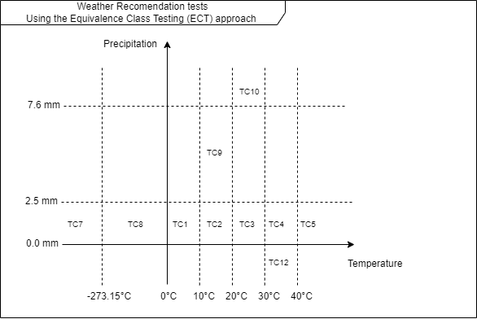

# Weather Recommendation Service Testing

## Purpose

This document is designed to teach students the Equivalence Class Testing (ECT) approach using the Weather Recommendation Service.

## Equivalence Class Testing (ECT) Approach

Equivalence Class Testing is a black-box testing method that divides the input data of a software unit into partitions of data from which test cases can be derived.

## Temperature-Based Clothing Recommendations
### Valid Equivalence Classes (VEC)
- **VEC1 (Very Cold)**: Temperature < 10°C
- **VEC2 (Cold)**: 10°C ≤ Temperature < 20°C
- **VEC3 (Warm)**: 20°C ≤ Temperature < 30°C
- **VEC4 (Hot)**: 30°C ≤ Temperature < 40°C
- **VEC5 (Very Hot)**: Temperature ≥ 40°C

### Invalid Equivalence Classes (IEC)
- **IEC1**: Temperature = null
- **IEC2**: Temperature < -273.15°C (Absolute zero)

### Test Cases
- **TC1 for VEC1**: Test with Temperature = 5°C, Precipitation = 1.0 mm
- **TC2 for VEC2**: Test with Temperature = 15°C, Precipitation = 1.0 mm
- **TC3 for VEC3**: Test with Temperature = 25°C, Precipitation = 1.0 mm
- **TC4 for VEC4**: Test with Temperature = 35°C, Precipitation = 1.0 mm
- **TC5 for VEC5**: Test with Temperature = 45°C, Precipitation = 1.0 mm
- **TC6 for IEC1**: Test with Temperature = null, Precipitation = 1.0 mm
- **TC7 for IEC2**: Test with Temperature = -300°C, Precipitation = 1.0 mm

## Precipitation-Based Recommendations

### Valid Equivalence Classes (VEC)
- **VEC1 (Light)**: 0 < Precipitation ≤ 2.5 mm
- **VEC2 (Moderate)**: 2.5 < Precipitation ≤ 7.6 mm
- **VEC3 (Heavy)**: Precipitation > 7.6 mm

### Invalid Equivalence Classes (IEC)
- **IEC1**: Precipitation = null
- **IEC2**: Precipitation < 0 mm

### Test Cases
- **TC8 for VEC1**: Test with Temperature = -5°C, Precipitation = 1.0 mm
- **TC9 for VEC2**: Test with Temperature = 15°C, Precipitation = 5.0 mm
- **TC10 for VEC3**: Test with Temperature = 25°C, Precipitation = 10.0 mm
- **TC11 for IEC1**: Test with Temperature = 10°C, Precipitation = null
- **TC12 for IEC2**: Test with Temperature = 35°C, Precipitation = -1.0 mm
